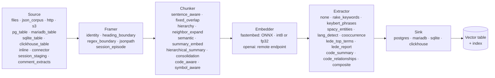
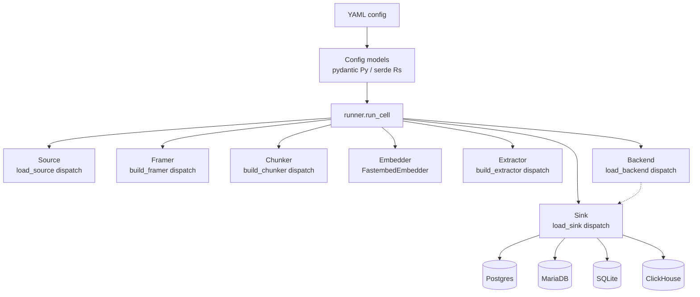
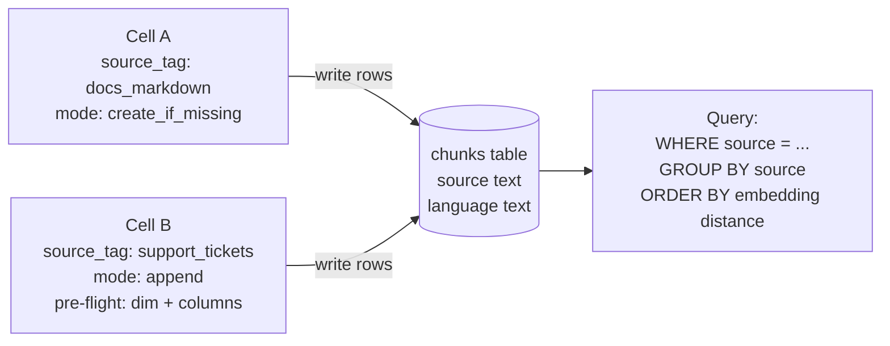
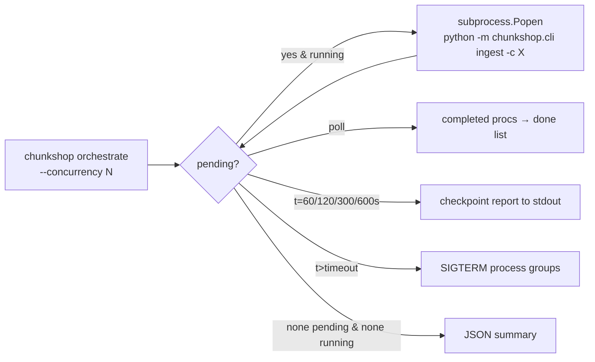

# chunkshop architecture

A chunkshop "cell" is one YAML config driving one end-to-end ingest: read
documents from a **Source**, optionally split them via a **Framer**, chunk
them, embed each chunk, optionally extract tags / metadata, and write rows
to a **Sink** backed by one of four supported database engines (Postgres,
MariaDB, SQLite, ClickHouse). Everything else — parallelism, model caching,
benchmarking, cross-language parity — is layered on top of that one unit.

This doc covers both reference implementations (Python at `python/`, Rust at
`rust/`). They share the same YAML schema, the same target table layout,
and the same pipeline contract; cells written in one are interoperable with
the other.

## Top-level pipeline



Each arrow is a contract. The Source emits `Document(id, content,
title?, metadata)` records. The Framer transforms one Document into one
or more framed Documents (default `identity` is a no-op). The Chunker
emits `Chunk(doc_id, seq_num, original_content, embedded_content,
metadata)` records. The Embedder turns embedded_content into vectors. The
Extractor produces tags + metadata. The Sink takes
`(chunks, embeddings, tags_per_chunk)` and writes durable rows to its
backend.

**Every stage is independent.** Swap any box without touching the others.
The 16-cell cross-backend matrix test (see
[`mixing-sources-and-sinks.md`](mixing-sources-and-sinks.md)) pins this
guarantee in CI.

## The three trait families

chunkshop's modular pipeline rests on three trait families. Each defines a
contract; concrete types implement the contract; sum types provide runtime
dispatch.

### Sources

```
trait Source (Python: Protocol with `iter_documents` method;
              Rust: inherent `iter_documents` per impl, dispatched via AnySource)

AnySource ::= Files | JsonCorpus | Http | S3 | Inline
            | PgTable | MariadbTable | SqliteTable | ClickhouseTable
```

5 file/network sources + 4 DB-table sources = 9 total. The DB-table sources
read existing rows from an upstream table — useful for migrations,
re-embeddings, and pulling docs out of operational stores.

### Sinks (and Backends)

Two-layer split:

- **Backend** owns dialect + raw connection management. Each engine has its
  own (`PostgresBackend`, `MariadbBackend`, `SqliteBackend`,
  `ClickhouseBackend`). The Rust trait surface formalizes this as
  `BackendDialect + BackendConn` traits (R1, refined in R2 with GATs);
  Python's equivalent lives in `chunkshop/backends/*.py`.

- **Sink** owns chunkshop's data-model semantics: table shape, mode
  dispatch (`overwrite` / `append` / `create_if_missing`), pre-flight
  checks, multi-source `source_tag` discipline, `promote_metadata` lifting,
  `query_top_k` shape.

```
trait Sink (Python: Protocol; Rust: trait Sink with async fn methods)

AnySink ::= Pg | Mariadb | Sqlite | Clickhouse
```

The split lets the dialect logic stay engine-specific while the chunkshop
behavior stays engine-agnostic. Adding a 5th engine = one new Backend + one
new Sink + two new AnyX variants.

### Chunkers, Framers, Embedders, Extractors

Same shape — one trait per family, multiple impls, a `load_*()` factory
that dispatches on the pydantic / serde discriminator. None of these are
backend-aware; they operate on in-memory text + vectors.

## Component map



The runner constructs each pipeline stage from its YAML section, then drives
the per-document loop. The `Backend` is constructed first (it owns the DSN +
connection), then handed to `load_sink` so the Sink can use the Backend's
dialect helpers.

## One ingest, step by step

```mermaid
sequenceDiagram
    participant U as User
    participant CLI as chunkshop ingest
    participant R as runner.run_cell
    participant S as Source
    participant F as Framer
    participant C as Chunker
    participant E as Embedder
    participant X as Extractor
    participant K as Sink
    participant DB as Backend DB

    U->>CLI: chunkshop ingest -c cell.yaml
    CLI->>R: load_config + run_cell(cfg)
    R->>R: cap OMP/MKL/OPENBLAS threads
    R->>K: create_table (mode dispatch)
    K->>DB: CREATE DATABASE/SCHEMA + CREATE TABLE

    loop for each raw row from source
        R->>S: iter_documents
        S-->>R: raw row
        R->>F: frame(raw)
        F-->>R: list of Documents

        loop for each framed document
            R->>C: chunk(doc)
            C-->>R: list of Chunks
            R->>E: embed(chunk.embedded_content)
            E-->>R: vectors
            R->>X: extract(chunk.original_content)
            X-->>R: ExtractResult per chunk
            R->>K: write_document(doc_id, chunks, vectors, tags)
            K->>DB: INSERT (UPSERT on PG / MariaDB / SQLite;<br/>INSERT-only on ClickHouse)
        end
    end

    R-->>CLI: CellResult (docs, chunks, wall_seconds)
    CLI-->>U: JSON summary; exit 0/1
```

### Per-document transactions

`Sink::write_document` (all 4 backends) opens a short-lived connection /
transaction per document. This is deliberate:

- Live progress queries from another session work (`SELECT COUNT(DISTINCT
  doc_id)` etc.).
- A crash halfway through loses at most the in-flight document. Reruns
  upsert cleanly (primary key is `{doc_id}::{seq_num}`).
- No long-held locks; no open cursor over the whole corpus.

**Exception: ClickHouse.** CH doesn't have UPSERT — re-running an `append`
cell against the default `MergeTree` engine writes duplicate rows. Use
`engine: "ReplacingMergeTree(created_at) ORDER BY (id)"` for lazy dedup at
merge time. See [`engines/clickhouse.md`](engines/clickhouse.md).

## Multi-source ingest and schema flexibility

A single chunks table can hold rows from multiple cells, each tagged with
its own `source_tag`. The `target` section in YAML drives this:

- `mode: create_if_missing` — first cell into a table. Creates if absent,
  no-op if present.
- `mode: append` — subsequent cells. Requires `source_tag`; runs pre-flight
  before writing.
- `mode: overwrite` — drops + recreates. Default. Refuses to drop a table
  that holds rows from a foreign `source_tag` unless `force_overwrite: true`.

Every row gets its cell's `source_tag` stamped into a dedicated `source`
column. The column is **write-once across UPSERTs** — if two cells collide
on `(doc_id, seq_num)`, the first writer owns the `source` value forever.
Provenance is a load-bearing guarantee, not a last-writer-wins race.

`target.promote_metadata` lifts JSON paths into typed columns. A
promotion spec like `[{path: "strategy", type: "text"}]` adds a
`strategy text` column and populates it from `metadata.strategy` on every
write. Column names are deterministic: `path` lowercased with `.` → `__`
(`entities.ORG` → `entities__org`). Identical on all 4 backends (with
engine-appropriate column types: `text` on PG, `VARCHAR` on MariaDB,
`TEXT` on SQLite, `String` on ClickHouse).

The append pre-flight runs before a single row is written. Per backend:

1. Target table exists.
2. `embedding` column / vec0 partner table dim matches the cell's
   embedder `dim`.
3. `source` column exists (or is added idempotently).
4. Every declared `promote_metadata` column exists or is addable with the
   declared type.

If any check fails, chunkshop raises and inserts nothing. Pre-flight
refusing early is why `mode: append` is safe to drive from multiple cells
in parallel.

### Append mode pre-flight contract

Every sink's `mode: append` path runs the same 4-step pre-flight BEFORE
any INSERT — the same contract across PG, MariaDB, SQLite, and ClickHouse
in both Python and Rust:

1. **Table exists.** If not, raise with a pointer to
   `mode: create_if_missing` for the first-cell-into-table flow.
2. **Embedding dim matches.** Read the existing table's vector column
   dim; compare to the cell's embedder `dim`. Refuse on mismatch
   (vectors would be incomparable).
3. **`source` column exists** or is addable via
   `ADD COLUMN IF NOT EXISTS`. Provenance requires this column on every
   chunkshop table; pre-existing v0.3.x tables get the column added the
   first time a v0.4.x cell appends to them.
4. **`promote_metadata` columns** exist or are addable with the declared
   type. Same `ADD COLUMN IF NOT EXISTS` pattern.

The pre-flight runs inside the same connection / transaction the
subsequent INSERT will use, so a refused pre-flight leaves the table
untouched. This is why `mode: append` is safe to drive from multiple
parallel cells — each one either proves it can write compatibly or
exits cleanly with no rows written.

The `mode: overwrite` foreign-tag refusal follows the same shape: same
business rule across all 4 sinks, same canonical error wording —
`"overwrite refuses to drop {qualified_table}: table holds rows with
source_tag values {foreign} that differ from this cell's source_tag
{my_tag}. Set target.force_overwrite: true in YAML to bypass."` —
across all 8 implementations (4 sinks × 2 languages). Adding a 5th
backend? Implement these 4 pre-flight steps in your sink's equivalent
of `_append_preflight` (Python) / `append_preflight` async fn (Rust),
and match the canonical wording for the overwrite-refusal path.

### Extractor contract

Extractors return `ExtractResult(tags: list[str], metadata: dict)`. The
runner merges the extractor's metadata with the chunker's per-chunk
metadata using **chunker-wins** semantics — on key collision, the
chunker's value sticks. This preserves per-chunk provenance (heading,
strategy) while letting extractors add document-level signals (detected
language, extracted keywords) without clobbering it.



Full walkthrough: [`tutorial-multi-source.md`](tutorial-multi-source.md).

## The `Chunk` contract

```python
@dataclass(frozen=True)
class Chunk:
    doc_id: str
    seq_num: int
    original_content: str   # used for fact-matching / audit
    embedded_content: str   # what gets embedded (may differ from original)
    metadata: dict
```

The `original_content` / `embedded_content` split is load-bearing. Some
chunkers (hierarchy, neighbor_expand, summary_embed,
hierarchical_summary) deliberately make embedded_content *different* from
original_content. The sink writes both. See
[`storage-model.md`](storage-model.md) for the full per-payload story.

## Cross-language parity

Python and Rust both implement the full single-cell pipeline, and the
bakeoff ships at parity on all 4 backends. The orchestrator (parallel
multi-cell fan-out), the connectors plugin layer, the code-aware chunkers,
and the read-side search CLI are Python-only.

| Layer | Python | Rust |
|---|---|---|
| Source / framer / chunker / embedder / extractor / sink | ✅ | ✅ |
| `Pipeline` (inline / library mode) | ✅ | ✅ |
| `chunkshop ingest` (one YAML → one cell) | ✅ | ✅ |
| `chunkshop bakeoff` (matrix → leaderboard → recommended.yaml) | ✅ multi-backend | ✅ multi-backend |
| `chunkshop orchestrate` (N cells as parallel subprocesses) | ✅ | ❌ |
| Cross-backend matrix tests (16 cells: 4 sources × 4 sinks) | ✅ | ✅ |
| Cross-language vector parity (one lang writes, other reads) | ✅ verified per-backend | ✅ verified per-backend |

The shared embedder is `fastembed` on Python and `ort` (ONNX Runtime) on
Rust — both load the same ONNX file from Hugging Face. For Xenova int8
BGE variants, Rust pins `intra_threads=1` for bit-near-exact parity vs
Python (validated by `tests/embedding_parity.rs`).

The shared YAML parser surface is `pyyaml.safe_load` on Python and
`serde_yaml_ng` on Rust (a maintained fork of `serde_yaml`; migrated from
`serde_yml` in v0.4.1 for supply-chain hygiene). Loading semantics are
identical across both — the same `serde` / pydantic derive contract;
behavior unchanged from prior chunkshop releases.

## Parallel orchestration



Each cell runs as a subprocess (`python -m chunkshop.cli ingest --config
X`). Subprocess isolation matters because:

1. fastembed / ONNX Runtime holds process-global state that doesn't play
   nicely with thread sharing. One ORT session per process keeps things
   simple.
2. A silent crash in one cell must not take down siblings or the
   orchestrator.

Each subprocess inherits the parent's env, so DSN env vars set once at the
shell apply to every cell.

The Rust port doesn't have an orchestrator — the use case is dominated
by Python deployments today.

## Thread discipline

Three layers cooperate on CPU thread count (Python; Rust uses
`embedder.threads` directly via ORT session config):

1. `runtime.omp_num_threads` in YAML → sets `OMP_NUM_THREADS`,
   `MKL_NUM_THREADS`, `OPENBLAS_NUM_THREADS`, `NUMEXPR_NUM_THREADS`
   before numpy/ONNX ever loads. These are read once at module init, so
   `runner.run_cell` sets them first thing.
2. `embedder.threads` in YAML → caps ORT `intra_op_num_threads` at session
   creation. Without this, fastembed auto-detects and sizes the pool to
   all cores — which thrashes badly when 4 cells run concurrently on a
   shared box.
3. `orchestrate --concurrency N` × `embedder.threads` should fit inside
   your physical CPU count. Rough rule: `concurrency × threads ≈ physical
   cores`.

## Key files

| Concern | Python | Rust |
|---|---|---|
| Config schema | `python/src/chunkshop/config.py` | `rust/chunkshop/src/config.rs` |
| CLI entry points | `python/src/chunkshop/cli.py` | `rust/chunkshop/src/main.rs` |
| Single-cell runner | `python/src/chunkshop/runner.py` | `rust/chunkshop/src/runner.rs` |
| Parallel orchestrator | `python/src/chunkshop/orchestrator.py` | — (not yet implemented) |
| Backend dialect / connect | `python/src/chunkshop/backends/` | `rust/chunkshop/src/backends/` |
| Sink data-model semantics | `python/src/chunkshop/sinks/` | `rust/chunkshop/src/sinks/` |
| Source protocol + impls | `python/src/chunkshop/sources/` | `rust/chunkshop/src/sources/` |
| Framer protocol + impls | `python/src/chunkshop/framers/` | `rust/chunkshop/src/framer.rs` |
| Chunker protocol + impls | `python/src/chunkshop/chunkers/` | `rust/chunkshop/src/chunker.rs` |
| Embedder protocol + impls | `python/src/chunkshop/embedders/` | `rust/chunkshop/src/embedder.rs` |
| Extractor protocol + impls | `python/src/chunkshop/extractors/` | `rust/chunkshop/src/extractor.rs` |
| Bakeoff runner | `python/src/chunkshop/bakeoff/` | `rust/chunkshop/src/bakeoff/` |

## Model download path

`FastembedProvider.__init__` constructs `fastembed.TextEmbedding(model_name=...)`. First use downloads ONNX files to `~/.cache/fastembed/`.
Subsequent uses are local. Int8 variants that aren't in fastembed's default
registry get added via `embedders/_registry.py` at import time (idempotent).

On Rust, the user-defined ONNX path (used for Xenova int8 BGE bit-near-exact
parity) downloads to `~/.cache/huggingface/`. Both languages cache locally
once downloaded; no internet required for subsequent runs.

See [`embedders.md`](embedders.md) for how to add a new model.

## Extension points

| You want to… | Drop a file in… | Register it in… |
|---|---|---|
| New source type | `sources/` (both langs) | `sources/__init__.py` (Py) / `sources/mod.rs` AnySource + load_source (Rs) + new pydantic / serde model in `config.{py,rs}` |
| New sink + new backend | `backends/<engine>.{py,rs}` + `sinks/<engine>.{py,rs}` (both langs) | Both langs: register `AnyBackend` + `AnySink` variants in `mod.rs`; add `TargetConfig::<Engine>` variant; add `load_backend` + `load_sink` dispatch arms |
| New framer | `framers/` (Py) / `framer.rs` (Rs) | `__init__.py` (Py) / `build_framer` (Rs) |
| New chunker | `chunkers/` (Py) / `chunker.rs` (Rs) | `__init__.py` + `ChunkerConfig` variant |
| New summarizer shim | `summarizers/` (Py) / `summarizer.rs` (Rs) | nothing — referenced from YAML by `module` + `function` path |
| New embedder backend | `embedders/` (Py) / `embedder.rs` (Rs) | `__init__.py` + `EmbedderConfig` variant |
| New extractor | `extractors/` (Py) / `extractor.rs` (Rs) | `__init__.py` + `ExtractorConfig` variant |
| New pre-quantized fastembed model | edit `embedders/_registry.py` `_INT8_VARIANTS` (Py) / `embedder::_registry` (Rs) | nothing — picked up at import |

Each provider type is a Python `Protocol` (or a Rust trait with sum-type
dispatch). The only requirement is the right method signature. No
inheritance. No base class to subclass.

## What chunkshop is not

- **Not a retrieval layer.** It writes to a vector table; you bring the
  query side. See [`query-clients.md`](query-clients.md) and the per-engine
  [`engines/`](engines/) docs for examples.
- **Not a streaming ingest.** It's a batch tool — runs to completion, exits,
  writes a summary.
- **Not an LLM wrapper.** The default extractor is `none`; built-in
  extractors (`rake_keywords`, `keybert_phrases`, `spacy_entities`,
  `lang_detect`, `composite`) are all local. The optional `summary_embed` /
  `hierarchical_summary` chunkers accept a `callable` summarizer module —
  users can wire an LLM there, but nothing in chunkshop's core ever calls
  one.
- **Not opinionated about schemas beyond the target table layout.** Source
  docs can be anything with an id and content field.
- **Not a tournament-winner for retrieval quality.** Use `chunkshop
  bakeoff` to measure combos on **your** corpus — the defaults are
  empirically sound but your data may favor a different combo.

## See also

- [`mixing-sources-and-sinks.md`](mixing-sources-and-sinks.md) — the 16-cell
  matrix, when to mix, and worked examples
- [`engines/`](engines/) — per-engine docs (postgres, mariadb, sqlite,
  clickhouse): connection, schema model, gotchas
- [`storage-model.md`](storage-model.md) — what gets written per row
- [`chunkers.md`](chunkers.md) — per-chunker behavior + benchmark verdict
- [`embedders.md`](embedders.md) — embedder mechanics + how to add a new
  model
- [`extractors.md`](extractors.md) — extractor specifics
- [`query-clients.md`](query-clients.md) — query examples per backend +
  language
