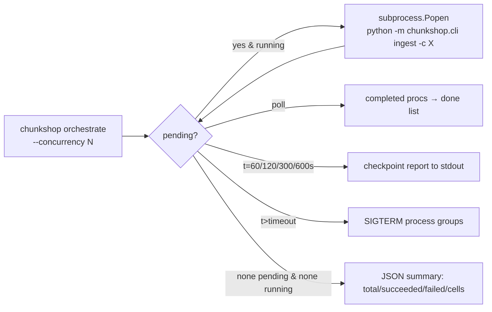

# chunkshop architecture

A chunkshop "cell" is one YAML config driving one end-to-end ingest: read documents from a
source, split them into chunks, embed each chunk, optionally tag it, and write rows to a
pgvector table. Everything else — parallelism, model caching, smoke tests — is layered on top
of that one unit.

This doc covers the Python reference implementation (`python/src/chunkshop/`). The Rust and
Go ports (planned) will mirror the same module boundaries and YAML schema, so the diagrams
here describe them too once they land.

## Component map

```mermaid
flowchart TB
    subgraph cli[CLI]
      I[chunkshop ingest]
      O[chunkshop orchestrate]
    end

    subgraph config[Config layer]
      Y[YAML file]
      P[pydantic models<br/>config.py]
    end

    subgraph runner[Single-cell runner]
      R[runner.run_cell]
    end

    subgraph providers[Pluggable providers]
      SRC[sources/<br/>files · json_corpus<br/>pg_table · http · s3]
      CHK[chunkers/<br/>sentence_aware<br/>fixed_overlap<br/>hierarchy<br/>neighbor_expand]
      EMB[embedders/<br/>fastembed_provider<br/>+ int8 _registry]
      EXT[extractors/<br/>none · rake_keywords]
    end

    subgraph sink[Sink]
      SK[PgVectorSink<br/>sink.py]
      DB[(pgvector table<br/>+ HNSW)]
    end

    subgraph orch[Orchestrator]
      OR[orchestrator.py<br/>subprocess pool]
    end

    I --> Y
    O --> Y
    Y --> P
    P --> R
    R --> SRC
    R --> CHK
    R --> EMB
    R --> EXT
    R --> SK
    SK --> DB
    O -.spawns N.-> I
    OR --- O
```



Each provider type is a `Protocol` with one method. `load_*()` factories dispatch on the
pydantic discriminator. Adding a new source/chunker/embedder/extractor = drop a file and add
one branch in the loader.

## Key files

| Concern                 | File                                                       |
|-------------------------|------------------------------------------------------------|
| Config schema           | `python/src/chunkshop/config.py`                           |
| CLI entry points        | `python/src/chunkshop/cli.py`                              |
| Single-cell execution   | `python/src/chunkshop/runner.py`                           |
| Parallel orchestration  | `python/src/chunkshop/orchestrator.py`                     |
| pgvector writer         | `python/src/chunkshop/sink.py`                             |
| Source protocol + impls | `python/src/chunkshop/sources/`                            |
| Chunker protocol + impls| `python/src/chunkshop/chunkers/`                           |
| Embedder protocol + impls | `python/src/chunkshop/embedders/`                        |
| int8 model registration | `python/src/chunkshop/embedders/_registry.py`              |
| Extractor protocol + impls | `python/src/chunkshop/extractors/`                      |

## One ingest, step by step

```mermaid
sequenceDiagram
    participant U as User
    participant CLI as chunkshop ingest
    participant R as runner.run_cell
    participant S as Source
    participant C as Chunker
    participant E as Embedder
    participant X as Extractor
    participant K as PgVectorSink
    participant DB as Postgres

    U->>CLI: chunkshop ingest -c cell.yaml
    CLI->>R: load_config + run_cell(cfg)
    R->>R: cap OMP/MKL/OPENBLAS threads
    R->>K: create_table (schema + HNSW index)
    K->>DB: CREATE EXTENSION vector<br/>CREATE TABLE / INDEX
    loop for each document in source
      R->>S: iter_documents → Document
      R->>C: chunk(doc) → list[Chunk]
      R->>E: embed([c.embedded_content ...]) → np.ndarray
      R->>X: extract(c.original_content) per chunk
      R->>K: write_document(doc_id, chunks, embeddings, tags)
      K->>DB: INSERT ... ON CONFLICT DO UPDATE (one txn per doc)
      alt every heartbeat_every docs
        R-->>U: stdout heartbeat
      end
    end
    R-->>CLI: CellResult (docs, chunks, wall_seconds)
    CLI-->>U: JSON summary; exit 0/1
```

### Why per-document transactions

`PgVectorSink.write_document` opens a short-lived connection and commits one transaction per
document. This is deliberate:

- `COUNT(DISTINCT doc_id)` from another psql session gives live ingest progress.
- A crash halfway through a run loses at most the in-flight doc; re-running the cell upserts
  the same rows (primary key is `{doc_id}::{seq_num}`).
- No long-held locks; no open cursor over the whole corpus.

Not a connection pool — this is batch ingest, not an online serving path.

## The `Chunk` contract

```python
@dataclass(frozen=True)
class Chunk:
    doc_id: str
    seq_num: int
    original_content: str   # used for fact-matching / audit
    embedded_content: str   # what gets embedded (may differ from original)
    metadata: dict
```

The `original_content` / `embedded_content` split is the load-bearing abstraction. Some
chunkers (hierarchy, neighbor_expand) add context into what gets embedded that shouldn't
be shown back verbatim to users. The `original_content` column stays grep-friendly and
audit-ready.

## Parallel orchestration



Each cell runs as a subprocess (`python -m chunkshop.cli ingest --config X`). Subprocess
isolation matters because:

1. Fastembed / ONNX Runtime holds process-global state that doesn't play nicely with thread
   sharing. One ORT session per process keeps things simple.
2. A silent crash in one cell must not take down siblings or the orchestrator.

Each subprocess inherits the parent's env, so `CHUNKSHOP_DSN` set once at the shell applies
to every cell.

## Thread discipline

Three layers cooperate on CPU thread count:

1. `runtime.omp_num_threads` in YAML → sets `OMP_NUM_THREADS`, `MKL_NUM_THREADS`,
   `OPENBLAS_NUM_THREADS`, `NUMEXPR_NUM_THREADS` before numpy/ONNX ever loads. These are
   read once at module init, so `runner.run_cell` sets them first thing.
2. `embedder.threads` in YAML → caps ORT `intra_op_num_threads` at session creation. Without
   this, fastembed auto-detects and sizes the pool to all cores — which thrashes badly when
   4 cells run concurrently on a shared box.
3. `orchestrate --concurrency N` × `embedder.threads` should fit inside your physical CPU
   count. Rough rule: `concurrency × threads ≈ physical cores`.

## Model download path

`FastembedProvider.__init__` constructs `fastembed.TextEmbedding(model_name=...)`. First use
downloads ONNX files to `~/.cache/fastembed/`. Subsequent uses are local. Int8 variants that
aren't in fastembed's default registry get added via `embedders/_registry.py` at import time
(idempotent).

See [`embedders.md`](embedders.md) for how to add a new model.

## Extension points

| You want to…                     | Add a file in…                              | Register it in…                                              |
|----------------------------------|---------------------------------------------|--------------------------------------------------------------|
| New source type (e.g. S3)        | `python/src/chunkshop/sources/`             | `sources/__init__.py` + new pydantic model in `config.py`    |
| New chunker                      | `python/src/chunkshop/chunkers/`            | `chunkers/__init__.py` + new pydantic model in `config.py`   |
| New embedder backend             | `python/src/chunkshop/embedders/`           | `embedders/__init__.py` + new pydantic model in `config.py`  |
| New extractor                    | `python/src/chunkshop/extractors/`          | `extractors/__init__.py` + new pydantic model in `config.py` |
| New pre-quantized fastembed model| edit `embedders/_registry.py` `_INT8_VARIANTS` | nothing — it's picked up at import                        |

Each provider is a `Protocol` — the only requirement is that your class has the right method
signature. No inheritance. No base class to subclass.

## What chunkshop is not

- Not a retrieval layer. It writes to pgvector; you bring the query side.
- Not a streaming ingest. It's a batch tool — runs to completion, exits, writes a summary.
- Not an LLM wrapper. The default extractor is `none`; the optional `rake_keywords` is purely
  local. There is no LLM in the ingest path.
- Not opinionated about schemas beyond the target table layout. Source docs can be anything
  with an id and content field.
