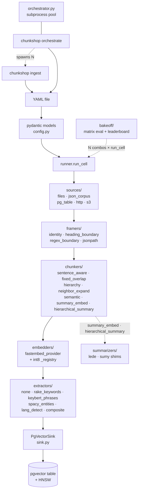
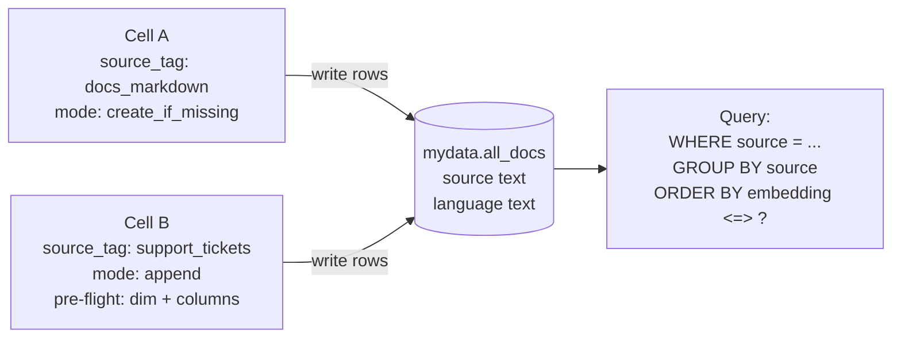
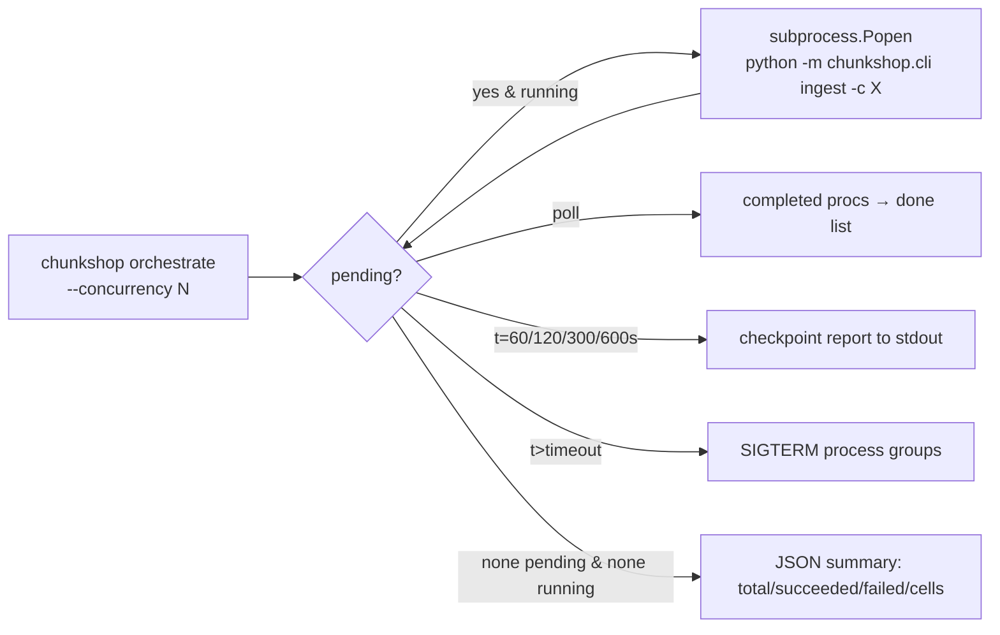

# chunkshop architecture

A chunkshop "cell" is one YAML config driving one end-to-end ingest: read documents from a
source, split them into chunks, embed each chunk, optionally tag it, and write rows to a
pgvector table. Everything else — parallelism, model caching, smoke tests — is layered on top
of that one unit.

This doc covers the Python reference implementation (`python/src/chunkshop/`). The Rust and
Go ports (planned) will mirror the same module boundaries and YAML schema, so the diagrams
here describe them too once they land.

## Component map



Read top to bottom: CLI loads YAML → pydantic config → runner. Runner drives the pipeline left-to-right (Source → Framer → Chunker → Embedder → Extractor → Sink → pgvector table). Orchestrator and bakeoff sit alongside the runner — they don't sit *in* the data path, they fan out cells across it.

Each provider type is a `Protocol` with one method. `load_*()` factories dispatch on the
pydantic discriminator. Adding a new source/framer/chunker/embedder/extractor = drop a file
and add one branch in the loader.

The **Framer** sits between Source and Chunker. A source row is frequently NOT the logical
ingest unit — a giant markdown dump holds many topics, a JSON API response nests docs under
`items[*]`. Framers split one raw source row into one-or-more framed `Document`s before
chunking. The default `identity` framer is a no-op pass-through, preserving backward
compatibility for every existing cell.

**Chunkers come in three families.** The four *structural* chunkers
(`sentence_aware`, `fixed_overlap`, `hierarchy`, `neighbor_expand`) split on
syntactic cues. The *semantic* chunker (`semantic`) cuts on sentence-embedding
similarity drops — use when your source has no syntactic structure (transcripts,
interviews, auto-captioned audio). The two *summary-layer* chunkers
(`summary_embed`, `hierarchical_summary`) wrap any base chunker and change what
gets embedded vs. what gets stored; they dispatch summary generation to an
external source column, a callable module (lede, sumy), or passthrough.
`chunkshop.summarizers.*` ships adapter shims so libraries with non-matching
APIs integrate via one YAML line.

The **bakeoff** module (`chunkshop.bakeoff.*`) sits next to the orchestrator.
It takes a YAML config naming a corpus, a gold-queries file, and a matrix of
chunker × embedder combos, then drives every combo through `run_cell` and
scores the results. Users get a leaderboard and a `recommended.yaml` they can
run directly.

## Key files

| Concern                 | File                                                       |
|-------------------------|------------------------------------------------------------|
| Config schema           | `python/src/chunkshop/config.py`                           |
| CLI entry points        | `python/src/chunkshop/cli.py`                              |
| Single-cell execution   | `python/src/chunkshop/runner.py`                           |
| Parallel orchestration  | `python/src/chunkshop/orchestrator.py`                     |
| pgvector writer         | `python/src/chunkshop/sink.py`                             |
| Source protocol + impls | `python/src/chunkshop/sources/`                            |
| Framer protocol + impls | `python/src/chunkshop/framers/`                            |
| Chunker protocol + impls| `python/src/chunkshop/chunkers/`                           |
| Summarizer dispatch + shims | `python/src/chunkshop/chunkers/_summarizer.py` + `python/src/chunkshop/summarizers/` |
| Embedder protocol + impls | `python/src/chunkshop/embedders/`                        |
| int8 model registration | `python/src/chunkshop/embedders/_registry.py`              |
| Extractor protocol + impls | `python/src/chunkshop/extractors/`                      |
| Bakeoff matrix runner   | `python/src/chunkshop/bakeoff/`                            |

## One ingest, step by step

```mermaid
sequenceDiagram
    participant U as User
    participant CLI as chunkshop ingest
    participant R as runner.run_cell
    participant S as Source
    participant F as Framer
    participant C as Chunker
    participant E as Embedder
    participant X as Extractor
    participant K as PgVectorSink
    participant DB as Postgres

    U->>CLI: chunkshop ingest -c cell.yaml
    CLI->>R: load_config + run_cell(cfg)
    R->>R: cap OMP/MKL/OPENBLAS threads
    R->>K: create_table
    K->>DB: CREATE EXTENSION vector
    K->>DB: CREATE TABLE + indexes

    loop for each raw row from source
        R->>S: iter_documents
        S-->>R: raw row
        R->>F: frame(raw)
        F-->>R: list of Documents

        loop for each framed document
            R->>C: chunk(doc)
            C-->>R: list of Chunks
            R->>E: embed(chunk.embedded_content)
            E-->>R: ndarray of vectors
            R->>X: extract(chunk.original_content)
            X-->>R: ExtractResult per chunk
            R->>K: write_document(doc_id, chunks, vectors, tags)
            K->>DB: INSERT ON CONFLICT DO UPDATE
            K-->>R: row count (one txn per doc)
        end
    end

    R-->>CLI: CellResult (docs, chunks, wall_seconds)
    CLI-->>U: JSON summary; exit 0/1
```

The outer loop runs once per source row; the inner loop once per framed
document. A single source row fans out to one or more framed documents
(e.g. `heading_boundary` splits a giant markdown into one Document per `##`
section); each framed doc flows independently through chunker → embedder →
extractor → sink, one Postgres transaction each.

### Why per-document transactions

`PgVectorSink.write_document` opens a short-lived connection and commits one transaction per
document. This is deliberate:

- `COUNT(DISTINCT doc_id)` from another psql session gives live ingest progress.
- A crash halfway through a run loses at most the in-flight doc; re-running the cell upserts
  the same rows (primary key is `{doc_id}::{seq_num}`).
- No long-held locks; no open cursor over the whole corpus.

Not a connection pool — this is batch ingest, not an online serving path.

## Multi-source ingest and schema flexibility

A single pgvector table can hold rows from multiple cells, each tagged with its own
`source_tag`. The `target` section in YAML drives this with four knobs:

- `mode: create_if_missing` — first cell into a table. Creates if absent, no-op if present.
- `mode: append` — subsequent cells. Requires `source_tag`; runs pre-flight before writing.
- `mode: overwrite` — `DROP TABLE IF EXISTS` + recreate. Default. Refuses to drop a table
  that holds rows from a foreign `source_tag` unless `force_overwrite: true`.

Every row written gets its cell's `source_tag` stamped into a dedicated `source text`
column. The column is **write-once** across `ON CONFLICT` upserts — if two cells collide on
`(doc_id, seq_num)`, the first writer owns the `source` value forever. This makes provenance
a load-bearing guarantee rather than a last-writer-wins race.

`target.promote_metadata` lifts jsonb paths into typed columns so they become first-class
filterable / indexable fields. A promotion spec like `[{path: "strategy", type: "text"}]`
adds a `strategy text` column and populates it from `metadata.strategy` on every write.
Column names are deterministic: `path` is lowercased and `.` becomes `__`
(`entities.ORG` → `entities__org`). Both the sink's pre-flight and write path derive the
identifier from the same `PromoteColumn.column_name` property.

The append pre-flight runs before a single row is written:

1. Target table exists.
2. `embedding` column dim matches the cell's embedder `dim`.
3. `source` column exists (or is added idempotently with `ADD COLUMN IF NOT EXISTS`).
4. Every declared `promote_metadata` column exists or is addable with the declared type.

If any check fails, chunkshop raises and inserts nothing. The pre-flight refusing early is
why `mode: append` is safe to drive from multiple cells in parallel — each cell either
proves it can write compatibly or exits cleanly.

### Extractor contract

Extractors return `ExtractResult(tags: list[str], metadata: dict)`. The runner merges the
extractor's metadata with the chunker's per-chunk metadata using **chunker-wins** semantics
— on key collision, the chunker's value sticks. This preserves per-chunk provenance
(heading, strategy) while letting extractors add document-level signals (detected language,
extracted keywords) without clobbering it.



Full walkthrough: [`tutorial-multi-source.md`](tutorial-multi-source.md).

## The `Chunk` contract

```python
@dataclass(frozen=True)
class Chunk:
    doc_id: str
    seq_num: int
    original_content: str   # used for fact-matching / audit
    embedded_content: str   # what gets embedded (may differ from original)
    metadata: dict
```

The `original_content` / `embedded_content` split is the load-bearing abstraction. Some
chunkers (hierarchy, neighbor_expand) add context into what gets embedded that shouldn't
be shown back verbatim to users. The `original_content` column stays grep-friendly and
audit-ready.

## Parallel orchestration



Each cell runs as a subprocess (`python -m chunkshop.cli ingest --config X`). Subprocess
isolation matters because:

1. Fastembed / ONNX Runtime holds process-global state that doesn't play nicely with thread
   sharing. One ORT session per process keeps things simple.
2. A silent crash in one cell must not take down siblings or the orchestrator.

Each subprocess inherits the parent's env, so `CHUNKSHOP_DSN` set once at the shell applies
to every cell.

## Thread discipline

Three layers cooperate on CPU thread count:

1. `runtime.omp_num_threads` in YAML → sets `OMP_NUM_THREADS`, `MKL_NUM_THREADS`,
   `OPENBLAS_NUM_THREADS`, `NUMEXPR_NUM_THREADS` before numpy/ONNX ever loads. These are
   read once at module init, so `runner.run_cell` sets them first thing.
2. `embedder.threads` in YAML → caps ORT `intra_op_num_threads` at session creation. Without
   this, fastembed auto-detects and sizes the pool to all cores — which thrashes badly when
   4 cells run concurrently on a shared box.
3. `orchestrate --concurrency N` × `embedder.threads` should fit inside your physical CPU
   count. Rough rule: `concurrency × threads ≈ physical cores`.

## Model download path

`FastembedProvider.__init__` constructs `fastembed.TextEmbedding(model_name=...)`. First use
downloads ONNX files to `~/.cache/fastembed/`. Subsequent uses are local. Int8 variants that
aren't in fastembed's default registry get added via `embedders/_registry.py` at import time
(idempotent).

See [`embedders.md`](embedders.md) for how to add a new model.

## Extension points

| You want to…                     | Add a file in…                              | Register it in…                                              |
|----------------------------------|---------------------------------------------|--------------------------------------------------------------|
| New source type (e.g. S3)        | `python/src/chunkshop/sources/`             | `sources/__init__.py` + new pydantic model in `config.py`    |
| New framer (doc-boundary splitter)| `python/src/chunkshop/framers/`            | `framers/__init__.py` + new pydantic model in `config.py`    |
| New chunker                      | `python/src/chunkshop/chunkers/`            | `chunkers/__init__.py` + new pydantic model in `config.py`   |
| New summarizer shim (for a callable-mode library) | `python/src/chunkshop/summarizers/` | Nothing — referenced from YAML by `module` + `function` path  |
| New embedder backend             | `python/src/chunkshop/embedders/`           | `embedders/__init__.py` + new pydantic model in `config.py`  |
| New extractor                    | `python/src/chunkshop/extractors/`          | `extractors/__init__.py` + new pydantic model in `config.py` |
| New pre-quantized fastembed model| edit `embedders/_registry.py` `_INT8_VARIANTS` | nothing — it's picked up at import                        |

Each provider is a `Protocol` — the only requirement is that your class has the right method
signature. No inheritance. No base class to subclass.

## What chunkshop is not

- Not a retrieval layer. It writes to pgvector; you bring the query side. See
  [`query-clients.md`](query-clients.md) for Python/JS/Rust/Go examples.
- Not a streaming ingest. It's a batch tool — runs to completion, exits, writes a summary.
- Not an LLM wrapper. The default extractor is `none`; the built-in
  `rake_keywords`, `keybert_phrases`, `spacy_entities`, `lang_detect`, and
  `composite` extractors are all local. The optional `summary_embed`/
  `hierarchical_summary` chunkers accept a `callable` summarizer module —
  users can wire an LLM there if they want, but nothing in chunkshop's core
  ever calls one.
- Not opinionated about schemas beyond the target table layout. Source docs can be anything
  with an id and content field.
- Not a tournament-winner for retrieval quality. Use `chunkshop bakeoff` to
  measure combos on **your** corpus — the defaults are empirically sound
  (factorial bench at 772 docs + 15-combo matrix at `docs/samples/`) but
  your data may favor a different combo.
