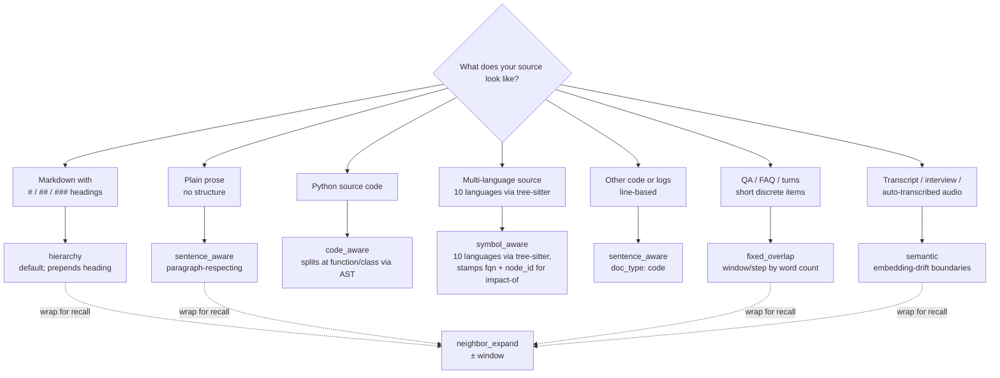

# Chunking strategies

chunkshop ships seven chunkers in two groups:

**Four structural chunkers** split on syntactic cues (headings, paragraphs, word
counts). Each produces a list of `Chunk` objects with two text fields:
`original_content` (raw, for grep / fact-match / audit) and `embedded_content`
(what the embedder sees, possibly with extra context prepended or appended).

- `sentence_aware` — paragraph-respecting prose splitter.
- `hierarchy` — splits on markdown headings; prepends the heading to the
  embedded content. **Shipped default.**
- `fixed_overlap` — dumb-but-predictable word-count windows with overlap.
- `neighbor_expand` — wraps any base chunker, glues ±N neighbor chunks into
  each row's embedded content for extra retrieval context.

**One semantic chunker** splits on topic-drift embeddings when your source has
no syntactic structure:

- `semantic` — embedding-drift boundary detection. Handles transcripts,
  interviews, auto-captioned audio where heading-based chunkers fail.

**Two summary-layer chunkers** wrap any base chunker and change what gets
embedded vs. what gets stored — see [`summaries.md`](summaries.md) for the
deep dive:

- `summary_embed` — base chunker emits rows; each row's `embedded_content`
  is replaced with a summary (external / callable / passthrough source).
  `original_content` stays raw.
- `hierarchical_summary` — emits base "fine" rows plus extra coarse summary
  rows, linked by `metadata.group_id`. Enables match-coarse / return-fine
  retrieval.

Pick one per cell. Structural and semantic chunkers can be wrapped by
`neighbor_expand`; summary-layer chunkers wrap any base chunker in their own
config.

## At a glance

All eight chunkers, side by side. The first six emit one chunk per chunk; the
last two are layers that wrap any base chunker.

| Chunker                 | One-line job                                                                | Best for                                                                | Key knobs                                                                                  | Layer? | Cross-language byte-identical? |
|-------------------------|-----------------------------------------------------------------------------|-------------------------------------------------------------------------|--------------------------------------------------------------------------------------------|:------:|:------------------------------:|
| `sentence_aware`        | Pack paragraphs/sentences into ≤ `max_chars` chunks, paragraph-respecting   | Plain prose, no headings; code with `doc_type: code`                    | `doc_type` (`prose` / `code`), `max_chars`, `min_chars`                                    |   no   |               ✅               |
| `hierarchy` (**default**) | Split on `#…` markdown headings; prepend the heading to `embedded_content` | Markdown with structure; the bakeoff-winning default                    | `prefix_heading`, `min_section_chars`, `max_chars`                                         |   no   |               ✅               |
| `fixed_overlap`         | Sliding word window with stride                                             | QA / FAQ rows; baseline / control in any bakeoff                        | `window_words`, `step_words`                                                               |   no   |               ✅               |
| `code_aware`            | Split Python at function/class boundaries via stdlib `ast`; non-Python falls back to `sentence_aware` | Source-code corpora — chunkshop's own tree, GitHub mirrors, vendor SDKs | `max_chars`, `include_imports`, `language` (`python`/`auto`)                            |   no   |    Python-only (no Rust port yet)   |
| `symbol_aware`          | Split at function/class/interface boundaries across **10 languages** — Python, Java, Go, TypeScript, JavaScript, Rust, C, C++, C#, and Ruby — all via real tree-sitter grammars in the `[code]` extra (`regex_fallback` only when `[code]` is absent); stamps `symbol_name` / `fqn` / `node_id` per chunk for `--by-symbol` and `impact-of` | Multi-language code corpora — what you reach for instead of `code_aware` when the repo isn't pure-Python | `granularity` (`function` / `class` / `module`), `include_imports`, `max_chars`, `languages` (list, or auto-detect from extension), `if_oversize` | no | Python-only (no Rust port yet) |
| `semantic`              | Boundary detection via sentence-embedding similarity drops                  | Transcripts, interviews, auto-captioned audio — anything with no headings | `boundary_model`, `breakpoint_percentile`, `min_sentences_per_chunk`, `max_chunk_chars`    |   no   |    algorithm-only (Rust drift ~1e-3 cos)    |
| `neighbor_expand`       | Wraps any base; glues ±N neighbors into each row's `embedded_content`       | Boost top-k recall when answers span chunks                             | `base`, `window`                                                                           |  yes   |               ✅               |
| `summary_embed`         | Wraps any base; replaces `embedded_content` with a summary                  | Match-summary / return-raw retrieval; long docs where raw embeds dilute | `base`, `summarizer` (external / callable / passthrough)                                    |  yes   |   ✅ (passthrough/external; Rust callable currently passthrough-only) |
| `hierarchical_summary`  | Wraps any base; emits both fine **and** coarse summary rows per group       | Two-stage retrieval (match-coarse → return-fine); long-context corpora  | `base`, `summarizer`, `grouping` (`fixed_n` / `word_budget` / `section_aware`)              |  yes   |   ✅ (passthrough/external)    |

For the two summary layers, see [`summaries.md`](summaries.md) for summarizer-mode
details (external / callable / passthrough) and grouping strategies. For an
empirical "which combo wins on **my** corpus" answer, see
[`tutorial-bakeoff.md`](tutorial-bakeoff.md) and
[`quickstart-bakeoff.md`](quickstart-bakeoff.md).

## Quick pick



## Tuning `max_chars` for your embedder

`max_chars` on `sentence_aware`, `hierarchy`, and `semantic` enforces an upper
bound so chunks never exceed the embedder's token limit. Defaults target the
BGE family (`bge-small`/`bge-base` share a 512-token limit). If you swap to a
larger-context embedder, raise it to match.

| Embedder                 | Token limit | Recommended `max_chars` |
|--------------------------|-------------|-------------------------|
| `bge-small-en-v1.5-int8` | 512         | `2000`                  |
| `bge-base-en-v1.5-int8`  | 512         | `2000` (**default**)    |
| `nomic-embed-text-v1.5`  | 8192        | `6000`                  |
| `text-embedding-3-small` | 8192        | `6000`                  |
| `text-embedding-3-large` | 8192        | `6000`                  |

Character-to-token ratio is corpus-dependent (~4 chars/token for English prose;
less for code, URLs, or non-Latin scripts). Defaults leave headroom. If you see
truncation warnings from the embedder, lower `max_chars`.

## What happens when a chunk would exceed `max_chars`

Each chunker handles "this chunk is too big" differently. **No chunker silently
drops content** — every character of the input is preserved across the output
chunks. But several chunkers can emit `embedded_content` that exceeds the base
`max_chars`, and that vector may then get truncated by the embedder.

| Chunker                | Char ceiling                | Behavior on overflow                                                                                           | Warns? |
|------------------------|-----------------------------|-----------------------------------------------------------------------------------------------------------------|:------:|
| `sentence_aware`       | `max_chars` (default 2000)  | Cascades paragraph → sentence → hard char-slice. `if_oversize` rarely fires.                                    | dedup'd warn (rare) |
| `hierarchy`            | `max_chars` (default 2000)  | Same cascade applied per section. `if_oversize` rarely fires.                                                   | dedup'd warn (rare) |
| `semantic`             | `max_chunk_chars` (default 2000) | Hard-splits on sentence boundary; logs WARN with span / body_len / sub-chunk count.                          | always |
| `fixed_overlap`        | `max_chars` (optional, new in 0.3.2) | If unset, char-unbounded (word-level only). If set: emits oversize chunks normally; if `if_oversize` set, routes through fallback; else logs ONE WARN per cell. | dedup'd if set |
| `neighbor_expand`      | `max_chars` (wrapper override) or `base.max_chars` (default) | If `if_oversize` set, oversize chunks routed through fallback. Else logs ONE WARN per cell.            | dedup'd |
| `summary_embed`        | `max_chars` (wrapper override) or `base.max_chars` (default) | Same as above.                                                                                          | dedup'd |
| `hierarchical_summary` | `max_chars` (wrapper override) or `base.max_chars` (default) | Fine rows: same as above. **Coarse rows are exempt** by design — they preserve 1-per-group structure.    | dedup'd (fine only) |

## Setting `if_oversize`

Every chunker config accepts an optional `if_oversize: ChunkerConfig` field
that points at a fallback chunker. When the parent chunker emits a chunk
whose `embedded_content` OR `original_content` exceeds the effective
ceiling, that chunk is replaced by the output of running `if_oversize`
over the offending text.

```yaml
chunker:
  type: neighbor_expand
  window: 2
  base:
    type: hierarchy
    max_chars: 1500
  if_oversize:
    type: fixed_overlap
    window_words: 200
    step_words: 160
    max_chars: 1500
```

The fallback chunker can itself have `if_oversize` (chains up to 5 levels deep).

When `if_oversize` is unset and a chunker would emit oversize chunks, you get
**one WARN line per cell** naming the chunker, ceiling, and a copy-paste
suggestion for setting `if_oversize`. No silent truncation.

For a runnable demo, see [`samples/if-oversize/`](samples/if-oversize/README.md).

## 1. `sentence_aware` — paragraph-respecting prose splitter

Source: `python/src/chunkshop/chunkers/sentence_aware.py`

```yaml
chunker:
  type: sentence_aware
  doc_type: prose        # or "code" — prose is the default
```

### What it does

- **prose mode** (default): finds markdown headings (`^#{1,6} `), keeps each section intact,
  hard-splits on paragraph → sentence → char boundaries if a section exceeds `max_chars`.
  No heading? Falls back to paragraph-respecting greedy packing.
- **code mode**: skips the heading pass, uses the paragraph-fallback splitter directly.
  Good for log files, source code, anything where `#` is a comment token rather than
  structure.

### Knobs

| YAML key     | Default | Notes                                                                   |
|--------------|---------|-------------------------------------------------------------------------|
| `max_chars`  | `2000`  | Hard cap on chunk size. See "Tuning `max_chars` for your embedder" below. |
| `min_chars`  | `200`   | Chunks below this are dropped when splitting a headed doc.              |
| `doc_type`   | `prose` | `prose` or `code`. No other values.                                     |

### When to pick it

- Generic prose ingest without strong heading discipline.
- You want to preserve paragraph boundaries.
- Your corpus mixes headed and headless docs.
- Source code or logs (`doc_type: code`).

### When not to

- Your docs have reliable markdown headings → `hierarchy` wins every benchmark column.
- Your docs are short QA pairs or FAQ turns → `fixed_overlap` is more predictable.

### Sample output

Input: a 5k-char markdown doc with two `##` sections.
Output: two chunks, one per section, each carrying the full section body.

## 2. `hierarchy` — prepends the section heading (**default**)

Source: `python/src/chunkshop/chunkers/hierarchy.py`

```yaml
chunker:
  type: hierarchy
  prefix_heading: true         # default
  min_section_chars: 100       # drop sections smaller than this
```

### What it does

Splits on markdown headings (`^#{1,6} `). For each section:

- `original_content` = section body only (no heading).
- `embedded_content` = `"{heading}\n\n{body}"` if `prefix_heading: true`.

Sections below `min_section_chars` are dropped. Pre-heading preamble, if ≥ `min_section_chars`,
is emitted as chunk 0 and prefixed with the document title (if any).

### Knobs

| YAML key            | Default | Notes                                                          |
|---------------------|---------|----------------------------------------------------------------|
| `max_chars`         | `2000`  | Hard cap; sections above are split on paragraph → sentence → char. |
| `prefix_heading`    | `true`  | Disable only if you're benchmarking "same chunker without prefix". |
| `min_section_chars` | `100`   | Drops nav fluff, 3-line "See also" sections.                   |

Split children of an oversized section carry `metadata.heading` (same as their parent) and
`metadata.section_part` (0-indexed per section). Non-split sections get `section_part: 0` too
— the key is always present, so downstream code doesn't need to branch on absence.

### Why it's the default

The factorial benchmark (772-doc legal QA, 30 gold questions) found that prepending the
section heading to each embedded chunk was the single biggest accuracy lever — it beat every
other chunker across every embedder column. The heading acts as free framing context at
embed time; at query time, semantically-adjacent queries pull the right section without the
user having to match the body text verbatim.

### When to pick it

- Your corpus has markdown headings that mean something.
- You want the production-sweet-spot default.
- Your retrieval queries are topical ("what does the policy say about X") rather than
  sentence-level ("find this exact quote").

### When not to

- Your docs have no headings → `sentence_aware` falls back gracefully; `hierarchy` emits one
  chunk per doc (which may be fine, just be aware).
- Your docs have aggressive heading structure with 1-line sections → tune
  `min_section_chars` up, or switch to `fixed_overlap`.

### Sample output

Input: a markdown doc with `# Title`, `## Section A`, `## Section B`.
Output: three chunks. Chunk 1's `embedded_content` starts with `"Section A\n\n..."`; its
`original_content` is the body only.

## 3. `fixed_overlap` — word-count window with overlap

Source: `python/src/chunkshop/chunkers/fixed_overlap.py`

```yaml
chunker:
  type: fixed_overlap
  window_words: 300    # chunk size in whitespace-split words
  step_words: 150      # how far the window slides → 50% overlap by default
```

### What it does

Splits the document on whitespace into words, then slides a fixed window. Chunk N's window is
`words[N*step : N*step + window]`. Overlap = `window − step`. Stops when the last window
reaches the end.

`original_content` and `embedded_content` are identical (no heading prefix, no neighbor
context).

### Knobs

| YAML key       | Default | Notes                                                  |
|----------------|---------|--------------------------------------------------------|
| `window_words` | `300`   | Must be > 0. ~400-500 tokens for typical English text. |
| `step_words`   | `150`   | Must be > 0. `step < window` creates overlap.          |

### When to pick it

- Short discrete items (QA pairs, tweets, turns).
- Predictability matters — you want every chunk the same size.
- Baseline for chunker comparisons.
- Your source has no markdown structure at all.

### When not to

- Prose with real paragraph boundaries → `sentence_aware` respects them.
- Markdown with headings → `hierarchy` is strictly better.
- Very long docs — lots of tiny chunks with overlap = more vectors to embed + store.

### Sample output

A 900-word doc with defaults (300/150): 5 chunks at word offsets 0, 150, 300, 450, 600. The
last chunk only has 300 words if 600 + 300 ≤ 900; otherwise it's whatever's left.

## 3.5. `code_aware` — split Python at function/class boundaries

Source: `python/src/chunkshop/chunkers/code_aware.py`

```yaml
chunker:
  type: code_aware
  max_chars: 4000
  include_imports: true        # prepend the import block to embedded_content
  language: auto               # "auto" sniffs by extension; "python" forces AST path
```

### What it does

Parses each `.py` document with the stdlib `ast` module and emits one chunk
per top-level function or class. Module-level statements (imports, constants,
`__all__`, etc.) gather into a leading `module_block` chunk so they don't get
sliced mid-statement. Non-Python documents delegate to the configured
`if_oversize` chunker (or a default `sentence_aware`) — `code_aware` is safe
to use as the chunker for a mixed corpus.

Each chunk's `original_content` is the raw source segment from
`ast.get_source_segment`. With `include_imports=true` (default), the file's
import block plus a `# Definition: <name>` marker is prepended to
`embedded_content` so the vector embeds the function with its dependency
context — a chunk that calls `BeautifulSoup(...)` embeds as code that
obviously uses `bs4`, even when the import statement is 200 lines away.

Malformed Python (`ast.parse` raises `SyntaxError`) is logged and emitted as
one fallback chunk with `strategy="code_aware_fallback"`.

### Knobs

| YAML key | Default | Notes |
|----------|---------|-------|
| `max_chars` | `4000` | Soft cap. A single oversize function stays whole unless `if_oversize` is set. |
| `min_chars` | `100` | Floor for small module-level blocks. |
| `include_imports` | `true` | Prepend the file's import block + `# Definition: <name>` to each `embedded_content`. `original_content` is never touched. |
| `language` | `"auto"` | `"auto"` sniffs `.py` by extension; `"python"` forces the AST path. |
| `if_oversize` | `null` | Fallback for oversize chunks and for non-Python documents. |

### When to pick it

- The corpus is source code (your own repos, GitHub mirrors, vendor SDKs).
- You want chunks that read like coherent units — one function, one class —
  rather than 300-word windows that bisect signatures.
- You want each chunk's embedding to "know" what library it uses.

### When not to

- The corpus is not source code.
- The corpus is non-Python source. `code_aware` falls back to
  `sentence_aware` for those, which works but provides no semantic boundary
  benefit over picking `sentence_aware` directly.

### Sample output

See [`cookbook/code-aware-chunking.md`](cookbook/code-aware-chunking.md) and
the demo at `python/examples/chunk_python_code.py`, which runs `code_aware`
over chunkshop's own source tree.

## 4. `neighbor_expand` — wrap another chunker, glue neighbors at embed time

Source: `python/src/chunkshop/chunkers/neighbor_expand.py`

```yaml
chunker:
  type: neighbor_expand
  window: 1                     # seq ± 1 neighbor
  base:
    type: sentence_aware        # any of the other three
    doc_type: prose
```

### What it does

Runs a base chunker first, then for each base chunk `i` builds a new chunk whose
`embedded_content` is the join of base chunks `[i-window, i+window]`. Clips at document
boundaries. `original_content` stays as chunk `i`'s own body.

So the retriever still sees "chunk 3" in `original_content` (clean audit), but the vector at
row 3 was computed from chunks 2, 3, and 4 glued together (more context).

### Knobs

| YAML key | Default | Notes                                                       |
|----------|---------|-------------------------------------------------------------|
| `window` | `1`     | Symmetric. `window=2` means embed with chunks i-2..i+2 (5). |
| `base`   | —       | Required. Nested chunker config — any of the other three.   |

### When to pick it

- Your chunks are short and semantically isolated (e.g. `fixed_overlap` with tiny windows).
- You're seeing retrieval recall misses where the "right" answer is one chunk over.
- You want contextual framing without changing chunk granularity.

### When not to

- Your base chunker's `max_chars` plus `window` × neighbor size exceeds your embedder's token
  budget. With the default `max_chars: 2000` and `window: 1`, each neighbor-expanded embed
  concatenates up to ~6000 chars (~1500 tokens) — safe for `bge-small-en-v1.5` at 512 tokens
  ONLY IF your base chunks are short enough. Drop `max_chars` to ~1500 on the base chunker if
  you see truncation.
- You're using `hierarchy` with `prefix_heading: true` — the heading already provides
  framing; expansion is double-dipping.

### Sample output

Base: 5 chunks from `sentence_aware`. `window=1`:

| Row | `original_content` | `embedded_content`                     |
|-----|--------------------|----------------------------------------|
| 0   | chunk 0            | chunk 0 + chunk 1                      |
| 1   | chunk 1            | chunk 0 + chunk 1 + chunk 2            |
| 2   | chunk 2            | chunk 1 + chunk 2 + chunk 3            |
| 3   | chunk 3            | chunk 2 + chunk 3 + chunk 4            |
| 4   | chunk 4            | chunk 3 + chunk 4                      |

## 5. `semantic` — embedding-drift boundary detection

### What it does

For each sentence in the document, embed it with a small dedicated model (the boundary
model), compute pairwise cosine similarity between consecutive sentences, and cut the
document wherever similarity drops below a percentile threshold (default: 95th percentile
of drops = break at the top-5% most dramatic topic shifts).

Below-threshold runs (< `min_sentences_per_chunk`) merge forward so tiny chunks don't
clutter the output. Oversized spans hard-split at `max_chunk_chars` on a sentence
boundary. Unlike `hierarchy` or `sentence_aware`, this chunker doesn't rely on any
syntactic cue — headings, paragraphs, sentence counts — only on meaning drift.

### Knobs

| YAML key | Default | Notes |
|---|---|---|
| `boundary_model` | `sentence-transformers/all-MiniLM-L6-v2-int8` | Small ONNX model (~22 MB). Chunkshop registers it in `embedders/_registry.py`. |
| `boundary_model: "same"` | (literal string) | Reuse the cell's main embedder — no second model load. Trades speed (main model is usually larger) for memory. |
| `breakpoint_percentile` | `95` | Higher = fewer, bigger chunks. Lower = more, smaller chunks. |
| `min_sentences_per_chunk` | `3` | Below-threshold spans merge with neighbors. |
| `max_chunk_chars` | `2000` | Hard upper bound; oversized spans hard-split on sentence boundary. Matches the `hierarchy`/`sentence_aware` default — safe for bge's 512-token limit. |
| `sentence_splitter` | `"naive"` | `"naive"` = regex on `.?!` + whitespace. `"nltk"` = NLTK's Punkt (needs the `punkt_tab` corpus, auto-downloaded on first use). |

### When to pick it

- Meeting transcripts, interview dumps, live-captioning output — no headings, no paragraphs.
- Long auto-generated summaries where topic shifts are real but not marked.
- Mixed-topic FAQ pages where one page conflates unrelated questions.

### When not to

- Structured markdown with real headings — `hierarchy` wins at no runtime cost.
- Code files — semantic drift tracks natural-language topicality, not function boundaries.
- Very short docs (< 10 sentences) — similarity stats are too noisy to pick meaningful breaks.

### Sample output

Fictitious interview transcript, `breakpoint_percentile=95`:

```
Input (328 sentences, ~5000 words, one continuous blob):
  "So I started at Datadog in 2018. Most of that time I was on observability...
   ...by late 2022 I had shipped three major releases. ... Moving on to salary
   expectations, I'm looking for $X + equity. ... On weekends I mostly hike
   the PCT with my dog."

Output (3 semantic chunks):
  Chunk 0: career history at Datadog (87 sentences)
  Chunk 1: salary + logistics (34 sentences)
  Chunk 2: hobbies (207 sentences)
```

### Speed

On CPU with the default MiniLM int8 boundary model, semantic chunking a 5000-word
document costs roughly **1.2x a main-cell bge-base embed pass** on the same doc
(measured in `tests/chunkshop/test_chunker_semantic_benchmark.py`, gate: ≤ 2x).
Boundary embedding is the bottleneck — ~300 short forward passes vs ~15 longer
ones on the main model. The `boundary_model: "same"` variant skips the second
load but the main model is usually larger, so it trades memory for speed.

## Benchmark takeaway

From chunkshop's factorial experiment (A=sentence_aware, B=hierarchy, C=fixed_overlap 300/150,
D=neighbor_expand over sentence_aware; each × 3 embedders × 2 precisions = 24 cells):

- **B (hierarchy) won every embedder column.**
- **D (neighbor_expand wrapping sentence_aware) was second.**
- A and C were neck-and-neck for third.

Your corpus may disagree. The factorial configs in `python/src/chunkshop/configs/factorial/`
and `configs/factorial-int8/` are the template for running your own bake-off — point them at
your data, swap in your DSN, run `chunkshop orchestrate --config-dir ...`.

## Writing a new chunker

1. Add `python/src/chunkshop/chunkers/my_chunker.py` with a class implementing
   `chunk(doc: Document) -> list[Chunk]`.
2. Add a pydantic config model to `python/src/chunkshop/config.py` with a unique `type` literal
   and include it in the `ChunkerConfig` union.
3. Add a branch to `load_chunker` in `python/src/chunkshop/chunkers/__init__.py`.
4. Write a test in `python/tests/chunkshop/test_chunkers.py`.

The `Chunker` protocol (in `chunkers/base.py`) is just:

```python
class Chunker(Protocol):
    def chunk(self, doc: Document) -> list[Chunk]: ...
```

No base class, no registration decorator. Drop file, wire loader, done.
