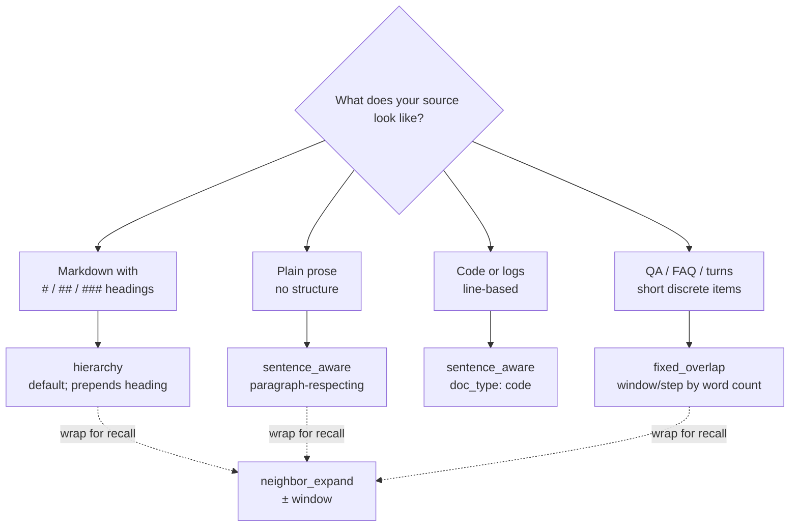

# Chunking strategies

chunkshop ships four chunkers. Every one produces a list of `Chunk` objects with two text
fields: `original_content` (raw, for grep / fact-match / audit) and `embedded_content` (what
the embedder sees, possibly with extra context prepended or appended).

All four accept any `Document` from any `Source`. Pick one per cell; you can also wrap any of
them with `neighbor_expand`.

## Quick pick



## 1. `sentence_aware` — paragraph-respecting prose splitter

Source: `python/src/chunkshop/chunkers/sentence_aware.py`

```yaml
chunker:
  type: sentence_aware
  doc_type: prose        # or "code" — prose is the default
```

### What it does

- **prose mode** (default): finds markdown headings (`^#{1,6} `), keeps each section intact,
  hard-splits at 3000 chars if a section is bigger. No heading? Falls back to paragraph-
  respecting greedy packing (splits on blank lines, accumulates up to `_MAX_CHARS = 3000`).
- **code mode**: skips the heading pass, uses the paragraph-fallback splitter directly.
  Good for log files, source code, anything where `#` is a comment token rather than
  structure.

### Knobs

| YAML key   | Default | Notes                                              |
|------------|---------|----------------------------------------------------|
| `doc_type` | `prose` | `prose` or `code`. No other values.                |

Module constants (not exposed in YAML — edit the file to change):

| Constant     | Value | Meaning                                           |
|--------------|-------|---------------------------------------------------|
| `_MAX_CHARS` | 3000  | ~750 tokens for `bge-small-en-v1.5`. Hard cap.    |
| `_MIN_CHARS` | 200   | Tiny fragments dropped after heading split.       |

### When to pick it

- Generic prose ingest without strong heading discipline.
- You want to preserve paragraph boundaries.
- Your corpus mixes headed and headless docs.
- Source code or logs (`doc_type: code`).

### When not to

- Your docs have reliable markdown headings → `hierarchy` wins every benchmark column.
- Your docs are short QA pairs or FAQ turns → `fixed_overlap` is more predictable.

### Sample output

Input: a 5k-char markdown doc with two `##` sections.
Output: two chunks, one per section, each carrying the full section body.

## 2. `hierarchy` — prepends the section heading (**default**)

Source: `python/src/chunkshop/chunkers/hierarchy.py`

```yaml
chunker:
  type: hierarchy
  prefix_heading: true         # default
  min_section_chars: 100       # drop sections smaller than this
```

### What it does

Splits on markdown headings (`^#{1,6} `). For each section:

- `original_content` = section body only (no heading).
- `embedded_content` = `"{heading}\n\n{body}"` if `prefix_heading: true`.

Sections below `min_section_chars` are dropped. Pre-heading preamble, if ≥ `min_section_chars`,
is emitted as chunk 0 and prefixed with the document title (if any).

### Knobs

| YAML key            | Default | Notes                                                          |
|---------------------|---------|----------------------------------------------------------------|
| `prefix_heading`    | `true`  | Disable only if you're benchmarking "same chunker without prefix". |
| `min_section_chars` | `100`   | Drops nav fluff, 3-line "See also" sections.                   |

### Why it's the default

The factorial benchmark (772-doc legal QA, 30 gold questions) found that prepending the
section heading to each embedded chunk was the single biggest accuracy lever — it beat every
other chunker across every embedder column. The heading acts as free framing context at
embed time; at query time, semantically-adjacent queries pull the right section without the
user having to match the body text verbatim.

### When to pick it

- Your corpus has markdown headings that mean something.
- You want the production-sweet-spot default.
- Your retrieval queries are topical ("what does the policy say about X") rather than
  sentence-level ("find this exact quote").

### When not to

- Your docs have no headings → `sentence_aware` falls back gracefully; `hierarchy` emits one
  chunk per doc (which may be fine, just be aware).
- Your docs have aggressive heading structure with 1-line sections → tune
  `min_section_chars` up, or switch to `fixed_overlap`.

### Sample output

Input: a markdown doc with `# Title`, `## Section A`, `## Section B`.
Output: three chunks. Chunk 1's `embedded_content` starts with `"Section A\n\n..."`; its
`original_content` is the body only.

## 3. `fixed_overlap` — word-count window with overlap

Source: `python/src/chunkshop/chunkers/fixed_overlap.py`

```yaml
chunker:
  type: fixed_overlap
  window_words: 300    # chunk size in whitespace-split words
  step_words: 150      # how far the window slides → 50% overlap by default
```

### What it does

Splits the document on whitespace into words, then slides a fixed window. Chunk N's window is
`words[N*step : N*step + window]`. Overlap = `window − step`. Stops when the last window
reaches the end.

`original_content` and `embedded_content` are identical (no heading prefix, no neighbor
context).

### Knobs

| YAML key       | Default | Notes                                                  |
|----------------|---------|--------------------------------------------------------|
| `window_words` | `300`   | Must be > 0. ~400-500 tokens for typical English text. |
| `step_words`   | `150`   | Must be > 0. `step < window` creates overlap.          |

### When to pick it

- Short discrete items (QA pairs, tweets, turns).
- Predictability matters — you want every chunk the same size.
- Baseline for chunker comparisons.
- Your source has no markdown structure at all.

### When not to

- Prose with real paragraph boundaries → `sentence_aware` respects them.
- Markdown with headings → `hierarchy` is strictly better.
- Very long docs — lots of tiny chunks with overlap = more vectors to embed + store.

### Sample output

A 900-word doc with defaults (300/150): 5 chunks at word offsets 0, 150, 300, 450, 600. The
last chunk only has 300 words if 600 + 300 ≤ 900; otherwise it's whatever's left.

## 4. `neighbor_expand` — wrap another chunker, glue neighbors at embed time

Source: `python/src/chunkshop/chunkers/neighbor_expand.py`

```yaml
chunker:
  type: neighbor_expand
  window: 1                     # seq ± 1 neighbor
  base:
    type: sentence_aware        # any of the other three
    doc_type: prose
```

### What it does

Runs a base chunker first, then for each base chunk `i` builds a new chunk whose
`embedded_content` is the join of base chunks `[i-window, i+window]`. Clips at document
boundaries. `original_content` stays as chunk `i`'s own body.

So the retriever still sees "chunk 3" in `original_content` (clean audit), but the vector at
row 3 was computed from chunks 2, 3, and 4 glued together (more context).

### Knobs

| YAML key | Default | Notes                                                       |
|----------|---------|-------------------------------------------------------------|
| `window` | `1`     | Symmetric. `window=2` means embed with chunks i-2..i+2 (5). |
| `base`   | —       | Required. Nested chunker config — any of the other three.   |

### When to pick it

- Your chunks are short and semantically isolated (e.g. `fixed_overlap` with tiny windows).
- You're seeing retrieval recall misses where the "right" answer is one chunk over.
- You want contextual framing without changing chunk granularity.

### When not to

- Your base chunker already emits long chunks (≥ 2000 chars) — you'll blow past the
  embedder's token limit. `bge-small-en-v1.5` truncates at 512 tokens.
- You're using `hierarchy` with `prefix_heading: true` — the heading already provides
  framing; expansion is double-dipping.

### Sample output

Base: 5 chunks from `sentence_aware`. `window=1`:

| Row | `original_content` | `embedded_content`                     |
|-----|--------------------|----------------------------------------|
| 0   | chunk 0            | chunk 0 + chunk 1                      |
| 1   | chunk 1            | chunk 0 + chunk 1 + chunk 2            |
| 2   | chunk 2            | chunk 1 + chunk 2 + chunk 3            |
| 3   | chunk 3            | chunk 2 + chunk 3 + chunk 4            |
| 4   | chunk 4            | chunk 3 + chunk 4                      |

## Benchmark takeaway

From chunkshop's factorial experiment (A=sentence_aware, B=hierarchy, C=fixed_overlap 300/150,
D=neighbor_expand over sentence_aware; each × 3 embedders × 2 precisions = 24 cells):

- **B (hierarchy) won every embedder column.**
- **D (neighbor_expand wrapping sentence_aware) was second.**
- A and C were neck-and-neck for third.

Your corpus may disagree. The factorial configs in `python/src/chunkshop/configs/factorial/`
and `configs/factorial-int8/` are the template for running your own bake-off — point them at
your data, swap in your DSN, run `chunkshop orchestrate --config-dir ...`.

## Writing a new chunker

1. Add `python/src/chunkshop/chunkers/my_chunker.py` with a class implementing
   `chunk(doc: Document) -> list[Chunk]`.
2. Add a pydantic config model to `python/src/chunkshop/config.py` with a unique `type` literal
   and include it in the `ChunkerConfig` union.
3. Add a branch to `load_chunker` in `python/src/chunkshop/chunkers/__init__.py`.
4. Write a test in `python/tests/chunkshop/test_chunkers.py`.

The `Chunker` protocol (in `chunkers/base.py`) is just:

```python
class Chunker(Protocol):
    def chunk(self, doc: Document) -> list[Chunk]: ...
```

No base class, no registration decorator. Drop file, wire loader, done.
