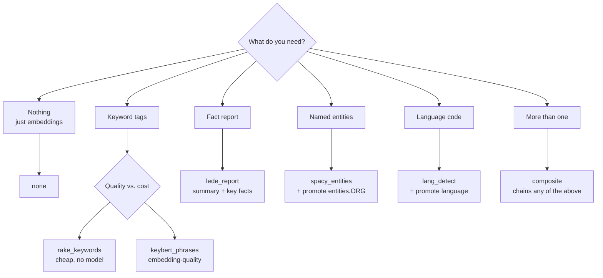

# Metadata extractors

chunkshop runs one extractor per cell after the chunker and before the sink. An
extractor reads a chunk's text and returns an `ExtractResult` with two fields:

- `tags: list[str]` — flat string list written to the row's `tags text[]`
  column. Good for full-text-ish filtering, UI tag clouds, or simple keyword
  matching.
- `metadata: dict` — merged into each chunk's `metadata jsonb` column before
  the sink write. **Chunker-emitted keys win on collision** (see
  `extractors/result.py` for the full rule). Structured metadata is what you
  promote to typed columns via `target.promote_metadata`.

chunkshop ships **eight extractor configs**. All except `none` and `rake_keywords`
require an optional pip extra — base install adds zero NLP weight.

| Extractor          | Ships as extra    | Tags           | Structured metadata          |
|--------------------|-------------------|----------------|------------------------------|
| `none`             | — (built-in)      | —              | —                            |
| `rake_keywords`    | `[extractors]`    | Top-K phrases  | —                            |
| `keybert_phrases`  | `[keybert]`       | Top-K phrases  | —                            |
| `lede_top_terms`   | `[lede]`          | Top terms      | —                            |
| `lede_report`      | `[lede]`          | Attributes/facts/entities | `lede_report: {...}`         |
| `spacy_entities`   | `[spacy]`         | —              | `entities: {label: [...]}`  |
| `lang_detect`      | `[lang]`          | —              | `language`, `language_confidence` |
| `composite`        | — (needs children's extras) | concat of children | merge of children (last wins) |

Install any combination of extras, or the umbrella `[nlp]` to get all three NLP
backends at once.

```bash
uv sync --extra lang              # just language detection
uv sync --extra lede              # lede report/top-terms extraction
uv sync --extra nlp               # keybert + spacy + langdetect
```

## Where chunk metadata comes from

Extractors are **one of four sources** that populate the `metadata jsonb`
column. If you're looking for a key in a chunk's metadata and don't see it,
work down this list:

| Source                              | Stage      | What it contributes                                                                                              |
|-------------------------------------|------------|-------------------------------------------------------------------------------------------------------------------|
| **Source — `pg_table.metadata_columns`** | Read       | Lifts named columns from the source row into chunk metadata (`product_name`, `customer_name`, `order_id`, …). Use a Postgres VIEW for JOINed columns. |
| **Source — file path / URL**        | Read       | `files` and `s3` sources record the path / URL on each chunk's metadata so you can trace back to the source file. |
| **Framer**                          | Frame      | The frame's section path or JSON pointer (e.g. `heading_path: ["Engineering", "Code review"]`).                  |
| **Chunker**                         | Chunk      | `strategy`, `heading`, `start_word`, `group_id`, etc. Chunker keys **win on collision** with extractor keys.      |
| **Extractor**                       | Extract    | This page's subject — `entities`, `language`, `language_confidence`, etc. Should namespace to avoid colliding with chunker keys. |

**Precedence on collision (later loses):** source → framer → chunker → extractor.
Chunker-emitted keys (`strategy`, `heading`, `start_word`) survive the merge.
Extractors should namespace their keys (`entities`, `language`, never bare
`strategy`). See `extractors/result.py`'s class docstring for the full merge
rule.

### Practical implication

If you want a structured metadata field like `product_name` next to your
vector — use the source layer (`pg_table.metadata_columns`), not an
extractor. Extractors are for derived metadata you compute *from the chunk
text*. Source columns and JOINed values belong on the read side.

For the JOIN-via-VIEW pattern with `pg_table.metadata_columns`, see
[`samples/sales-crm/README.md`](samples/sales-crm/README.md). Once metadata
lands in the `metadata jsonb` column, promote selected paths to typed
Postgres columns with `target.promote_metadata` — see
[`quickstart-multi-source.md`](quickstart-multi-source.md).

## 1. `rake_keywords` — classical keyword extraction (RAKE)

> **Why use this.** You want a cheap, no-model, no-GPU keyword tag list on
> every chunk — purely for UI display, grep-style filtering, or a quick tag
> cloud. RAKE is the simplest choice: pure-Python, deterministic, zero network
> after first NLTK download. Pick this over `keybert_phrases` when you don't
> care about embedding-quality phrases and just need *something* populated.

### What it does

Runs RAKE (Rapid Automatic Keyword Extraction) via `rake-nltk`. Scores candidate
phrases by co-occurrence with stopwords; returns the top-K ranked phrases.
First use downloads NLTK's `stopwords` and `punkt` corpora (~20 MB total,
cached to `~/nltk_data/`).

### YAML

```yaml
extractor:
  type: rake_keywords
  top_k: 10        # default
  min_chars: 3     # drop phrases shorter than this
```

### Config fields

| Field       | Default | Notes                                                 |
|-------------|---------|-------------------------------------------------------|
| `top_k`     | `10`    | Number of phrases to keep (ranked by RAKE score).    |
| `min_chars` | `3`     | Drops single-char or 2-char phrases; tune to taste.  |

### Sample output

```yaml
# Input chunk text:
#   "The Supreme Court ruled on civil rights in Bostock v. Clayton County."

tags: ["bostock v", "clayton county", "civil rights", "supreme court"]
metadata: {}
```

### Pairing with `promote_metadata`

RAKE only writes `tags`, which is already its own typed column — no promotion
needed. If you want a GIN index for tag filtering:

```sql
CREATE INDEX ON mydata.chunks USING gin (tags);
SELECT * FROM mydata.chunks WHERE tags @> ARRAY['civil rights'];
```

### Install

```bash
uv sync --extra extractors
```

### When NOT to pick it

- You need high-quality, semantic phrases — use `keybert_phrases`.
- You need structured output (entities, language) — RAKE emits no metadata.

---

## 2. `keybert_phrases` — embedding-based keyphrases

> **Why use this.** You want UI-friendly, semantically-coherent topic labels
> per chunk — the kind you'd show in a search-result card or a facet filter.
> KeyBERT scores candidate n-grams by cosine similarity to the document
> embedding, so the top phrases actually reflect the chunk's *meaning* rather
> than its raw token co-occurrence. Use this over `rake_keywords` when phrase
> quality matters (public-facing tags, analyst-grade facets). Use it over
> `spacy_entities` when you want *topics*, not named entities.

### What it does

`KeyBERT(model="all-MiniLM-L6-v2")` embeds the document and every candidate
n-gram, returns the top-K by cosine similarity. First use downloads the
sentence-transformers model (~90 MB) to `~/.cache/huggingface/`.

### YAML

```yaml
extractor:
  type: keybert_phrases
  top_k: 10                        # default
  model_name: all-MiniLM-L6-v2     # swap for a larger model if needed
  keyphrase_ngram_range: [1, 2]    # unigrams + bigrams
```

### Config fields

| Field                    | Default                | Notes                                                      |
|--------------------------|------------------------|------------------------------------------------------------|
| `top_k`                  | `10`                   | Number of phrases.                                        |
| `model_name`             | `"all-MiniLM-L6-v2"`  | Any sentence-transformers model identifier.              |
| `keyphrase_ngram_range` | `[1, 2]`              | Min/max n-gram length. `[1, 3]` adds trigrams.            |

### Sample output

```yaml
# Input chunk text (tech blog excerpt):
#   "Vector databases index high-dimensional embeddings for approximate
#    nearest neighbor search. pgvector brings HNSW indexes..."

tags: ["pgvector", "vector databases", "embeddings", "hnsw indexes", "nearest neighbor"]
metadata: {}
```

### Pairing with `promote_metadata`

Same shape as RAKE — phrases land in `tags`, no dotted-path promotion needed.
Promote if you want an extractor-tagged column:

```yaml
# No promote_metadata fields needed — query tags[] directly:
```

```sql
CREATE INDEX ON mydata.chunks USING gin (tags);
SELECT doc_id, tags FROM mydata.chunks
WHERE tags @> ARRAY['embeddings']
ORDER BY seq_num;
```

### Install

```bash
uv sync --extra keybert
```

### When NOT to pick it

- Your ingest box has no spare memory for a ~90 MB transformer and its CPU
  bill — `rake_keywords` is orders of magnitude cheaper.
- You need named entities (ORG, PERSON) — use `spacy_entities`.

---

## 3. `lede_report` — compact facts + readable report metadata

> **Why use this.** You want retrieval-side facts that are cheap to inspect
> and easy to feed into answer generation or LLM judging. This is the first
> choice for legal, policy, documentation, and support corpora where dates,
> amounts, headings, and key factual sentences matter more than a tag cloud.

### What it does

Calls `lede.readable_report()` on the chunk text. The full JSON report lands under
`metadata.lede_report`; selected report fields become flat tags so they can
participate in filtering, display, or search diagnostics. The default
`max_chars: 4000` keeps reports compact while preserving enough factual detail
for SCOTUS-style questions. In lede v0.4.5+, JSON includes normalized
`attributes`, `fact_records`, `promotion_candidates`, and `search_text`.

### YAML

```yaml
extractor:
  type: lede_report
  max_chars: 4000
  max_facts: 40
  backend: regex        # deterministic default; use spacy for NER sections
  keep_headings: true
  include_toc: true
  tag_sources: [attributes, key_facts, dates, amounts, entities]
```

### Config fields

| Field           | Default                                      | Notes                                                |
|-----------------|----------------------------------------------|------------------------------------------------------|
| `max_chars`     | `4000`                                       | Character budget passed to `readable_report`.       |
| `max_facts`     | `40`                                         | Maximum facts in the report.                        |
| `backend`       | `regex`                                      | `regex`, `spacy`, or `auto`.                        |
| `keep_headings` | `true`                                       | Preserve heading context in summary output.         |
| `include_toc`   | `true`                                       | Include table-of-contents-style heading summary.    |
| `tag_sources`   | `[attributes, key_facts, dates, amounts, entities]` | Report sections copied into `tags`.                 |
| `max_tag_chars` | `240`                                        | Per-tag truncation budget.                          |

### Sample output

```yaml
tags:
  - "2023"
  - "23-108"
  - "Docket Number: 23-108"
  - "$13,000"
metadata:
  lede_report:
    summary: "..."
    attributes:
      term: {value: "2023", type: year}
      docket_number: {value: "23-108", type: identifier}
    key_facts: ["Docket Number: 23-108", "..."]
    promotion_candidates:
      - {path: lede_report.attributes.term.value, key: term, promote: true}
    search_text: "..."
    metadata:
      dates: ["2024"]
      amounts: ["$13,000"]
```

### Install

```bash
uv sync --extra lede
# For backend: spacy, also install:
uv sync --extra lede --extra lede-spacy
```

Use `backend: spacy` when entity coverage is more important than dependency
weight. The spaCy backend adds `spacy_metadata` and `spacy_phrases` sections to
the report if the spaCy package/model is available.

For SQL-friendly reports, promote the stable v0.4.5 JSON paths:

```yaml
target:
  promote_metadata:
    - { path: lede_report.attributes.term.value, type: text }
    - { path: lede_report.attributes.docket_number.value, type: text }
    - { path: lede_report.attributes.citation.value, type: text }
  fts:
    enabled: true
    include_metadata_paths:
      - lede_report.search_text
```

### When NOT to pick it

- You only need a light tag cloud — use `lede_top_terms`, `rake_keywords`, or
  `keybert_phrases`.
- You need typed entity arrays for direct SQL filters — use `spacy_entities`
  or combine both with `composite`.

---

## 4. `spacy_entities` — Named Entity Recognition

> **Why use this.** You want to filter retrievals by organization, person, or
> place without reading every chunk. For example: "find me all chunks that
> mention Apple," or "show me rows tagged with entities in Germany." Entities
> land as structured `{label: [mentions]}` metadata — promotable to a
> `text[]` column per label. This is the single biggest win for
> enterprise-style RAG where the user already knows a proper noun.

### What it does

Runs spaCy's pre-trained NER on the chunk. Groups mentions by spaCy label
(ORG, PERSON, GPE, DATE, LAW, …), filtered through a `label_whitelist`,
deduped in first-appearance order within each label. First use downloads the
spaCy model (default `en_core_web_sm`, ~50 MB) via `spacy download`, printed
to stderr — same UX as the NLTK auto-download in `rake_keywords`.

### YAML

```yaml
extractor:
  type: spacy_entities
  model: en_core_web_sm                            # default
  label_whitelist: [ORG, PERSON, GPE, DATE, LAW]  # default
```

### Config fields

| Field              | Default                             | Notes                                                           |
|--------------------|-------------------------------------|-----------------------------------------------------------------|
| `model`            | `"en_core_web_sm"`                 | Any spaCy model name. `en_core_web_trf` for transformer quality.|
| `label_whitelist` | `[ORG, PERSON, GPE, DATE, LAW]`    | Filter what ends up in metadata. Unknown labels are dropped.   |

### Sample output

```yaml
# Input chunk text:
#   "Apple Inc. acquired Beats Electronics in 2014.
#    Tim Cook announced the deal in Cupertino."

tags: []
metadata:
  entities:
    ORG: ["Apple Inc.", "Beats Electronics"]
    PERSON: ["Tim Cook"]
    DATE: ["2014"]
    GPE: ["Cupertino"]
```

### Pairing with `promote_metadata`

This is where the real power lands. Dotted paths lift per-label entity arrays
to typed columns for fast SQL filters and GIN indexes:

```yaml
target:
  promote_metadata:
    - path: entities.ORG
      type: "text[]"
    - path: entities.PERSON
      type: "text[]"
    - path: entities.GPE
      type: "text[]"
```

Dotted paths lowercase-flatten into column names:
`entities.ORG` → `entities__org`, `entities.PERSON` → `entities__person`.

```sql
-- Every chunk that mentions Apple:
SELECT doc_id, seq_num, original_content
FROM mydata.chunks
WHERE "entities__org" @> ARRAY['Apple Inc.'];

-- GIN index for fast array-contains lookups:
CREATE INDEX chunks_entities_org_gin ON mydata.chunks USING gin ("entities__org");

-- Top 10 orgs across the corpus:
SELECT org, COUNT(*) AS mentions
FROM mydata.chunks, unnest("entities__org") AS org
GROUP BY org ORDER BY mentions DESC LIMIT 10;
```

### Install

```bash
uv sync --extra spacy
# Optional — the extractor auto-downloads on first use:
uv run python -m spacy download en_core_web_sm
```

### When NOT to pick it

- Your text is not English — swap the model (`en_core_web_sm` →
  `xx_ent_wiki_sm` for multilingual; see spaCy's model catalogue). chunkshop
  doesn't bundle multi-model logic; one cell, one model.
- You need relation extraction (who-did-what-to-whom) — out of scope;
  consider a specialized NER+RE library.

---

## 5. `lang_detect` — language code + confidence

> **Why use this.** Your corpus mixes English with other languages and you
> need to segment queries per language. For example: a support-ticket corpus
> where French-speaking users ask different questions than English-speakers,
> and your retriever should filter to the right language before ranking. Also
> useful as a cheap "data quality" signal — if `language_confidence` is low
> and the mentioned language is Japanese but you expected English, you've got
> mis-classified rows.

### What it does

Detects the dominant ISO-639-1 language code for the chunk via `langdetect`
(pure-Python port of Google's language-detection library). Seeded for
determinism. No model download, no network.

### YAML

```yaml
extractor:
  type: lang_detect
  backend: langdetect     # currently the only backend; fasttext was considered
```

### Config fields

| Field     | Default       | Notes                                  |
|-----------|---------------|----------------------------------------|
| `backend` | `"langdetect"` | Only supported value today.           |

### Sample output

```yaml
# Input: "Der schnelle braune Fuchs springt über den faulen Hund..."
tags: []
metadata:
  language: de
  language_confidence: 0.9999958
```

Empty or whitespace-only input returns `{"language": null, "language_confidence": 0.0}`
— the extractor never raises.

### Pairing with `promote_metadata`

```yaml
target:
  promote_metadata:
    - path: language
      type: text
    - path: language_confidence
      type: int              # promote only if you want to filter by threshold
```

```sql
-- Per-language row counts:
SELECT language, COUNT(*) FROM mydata.chunks GROUP BY language ORDER BY 2 DESC;

-- French-only retrieval:
SELECT doc_id, original_content
FROM mydata.chunks
WHERE language = 'fr'
ORDER BY embedding <=> $1 LIMIT 10;
```

### Install

```bash
uv sync --extra lang
```

### When NOT to pick it

- Your corpus is guaranteed single-language — wasted metadata column.
- Chunks are very short (< ~20 words) — detection accuracy drops sharply on
  short inputs. Consider running `lang_detect` at the document level and
  inheriting, rather than per-chunk.

---

## 6. `composite` — chain multiple extractors

> **Why use this.** One extractor isn't enough. You want entities *and*
> language *and* keyphrases in one ingest pass, written to the same chunk's
> metadata. `composite` chains child extractors in order, concatenates their
> `tags` lists, and merges their `metadata` dicts. It's the recommended way
> to ship a production ingest that needs multi-dimensional metadata.

### What it does

Instantiates each child extractor. For each chunk:

1. Runs children in declaration order.
2. Concatenates `tags` lists (no dedupe).
3. Updates the metadata dict in order. **Last child wins on key collision.**
4. If any child raises, composite re-raises `RuntimeError` with the child
   class name and the original exception chained — **no silent swallowing**.

### YAML

```yaml
extractor:
  type: composite
  extractors:
    - type: spacy_entities
      label_whitelist: [ORG, PERSON, GPE]
    - type: lang_detect
    - type: keybert_phrases
      top_k: 5
```

### Config fields

| Field        | Default | Notes                                                           |
|--------------|---------|-----------------------------------------------------------------|
| `extractors` | `[]`    | Ordered list of child extractor configs (any combination).     |

### Sample output

```yaml
# Three children above, input chunk:
#   "Apple Inc. reported record earnings. Tim Cook spoke in Cupertino."

tags: ["apple", "tim cook", "record earnings", "cupertino", "reported"]
metadata:
  entities:
    ORG: ["Apple Inc."]
    PERSON: ["Tim Cook"]
    GPE: ["Cupertino"]
  language: en
  language_confidence: 0.9999952
```

### Pairing with `promote_metadata`

Promote paths from any child. The `composite` extractor doesn't introduce new
paths — it merges children's output, so promoted paths reference the
*children's* schema.

```yaml
target:
  promote_metadata:
    - path: entities.ORG
      type: "text[]"
    - path: entities.PERSON
      type: "text[]"
    - path: language
      type: text
```

### Install

No extra of its own — install extras for each child. For the YAML above:

```bash
uv sync --extra spacy --extra lang --extra keybert
# Or the umbrella:
uv sync --extra nlp
```

### When NOT to pick it

- You only need one extractor — use it directly; composite adds a tiny
  overhead and a more complex config.
- Two children write the same metadata key (e.g. two keyphrase extractors
  both writing `keyphrases`) — later wins silently. Rename one of the keys
  via a custom extractor wrapper, or pick one child. Composite does not
  namespace for you.

---

## When to pick which

| You want…                                        | Pick                                    |
|--------------------------------------------------|------------------------------------------|
| Nothing — skip extraction                        | `none` (default)                         |
| Cheap keyword tags for UI                        | `rake_keywords`                          |
| High-quality semantic topic labels               | `keybert_phrases`                        |
| Compact fact/report metadata for judged RAG      | `lede_report`                            |
| Filter retrievals by org / person / place        | `spacy_entities` + promote `entities.ORG` |
| Segment by language in a multilingual corpus     | `lang_detect` + promote `language`        |
| All of the above in one pass                     | `composite` chaining them all            |

Decision tree:



## Writing a new extractor

1. Add `python/src/chunkshop/extractors/my_extractor.py` with a class
   implementing `extract(text: str) -> ExtractResult`.
2. Add a pydantic config model to `config.py` with a unique `type` literal
   and include it in the `ExtractorConfig` union.
3. Add a branch to `load_extractor` in `extractors/__init__.py`.
4. Write a unit test in `python/tests/chunkshop/test_extractor_<name>.py`.
5. If it needs heavy deps, add a `[myextractor]` extra to `pyproject.toml`
   and add `pytest.importorskip("...")` to the top of the test file.

The `Extractor` protocol (in `extractors/base.py`) is just:

```python
class Extractor(Protocol):
    def extract(self, text: str) -> ExtractResult: ...
```

No base class, no registration decorator. Drop file, wire loader, done.
